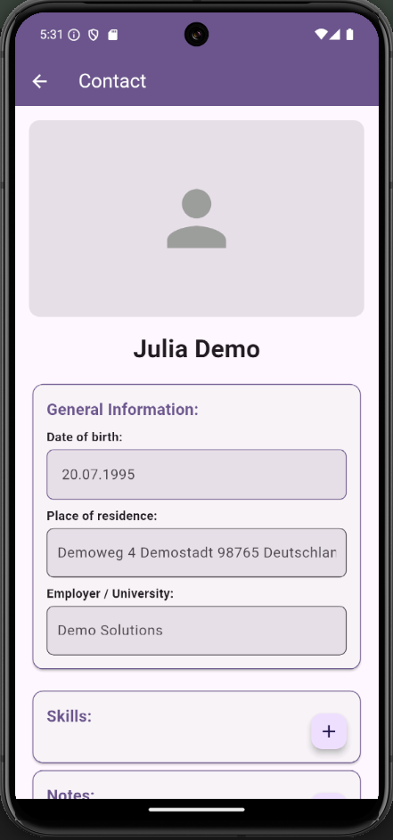

# Connect2

## Overview

**Connect2** is a feature-rich contacts management application designed to extend the functionality of a traditional contacts app. Users can store additional data and define relationships between their phone contacts.

### Key Features

1. **Home View**: Displays a list of all contacts.
2. **Contact Details**: Edit basic contact information and add:
   - Relationships to other contacts.
   - Skills associated with the contact.
   - Notes about the contact.
3. **Graph View**: Visualize all contacts as a graph with connections based on defined relationships, showcasing shared and unique skills.
4. **Own Contact View**: Easily designate one contact as your own for quick access.

---

## Getting Started

### Prerequisites

- **Android Device or Emulator**: The app is optimized for Android devices or emulators running **SDK 34** (Android 14). In the past errors occoured so that we also had to install SDK version 31.
- **Flutter SDK**: Ensure Flutter is installed and set up on your development environment. For installation instructions, visit the [official Flutter documentation](https://flutter.dev/docs/get-started/install).

### Installation

1. Clone the repository:
   ```bash
   git clone https://github.com/Driemtax/connect2.git
   cd connect2
   ```

2. Fetch dependencies:
   ```bash
   flutter pub get
   ```

3. Launch the app:
   ```bash
   flutter run
   ```
   Flutter currently has in some cases this issue: https://github.com/flutter/flutter/issues/146890

   You can solve this by launching the app like this:

   ```bash
   flutter run --enable-software-rendering
   ```

### Testing with an Emulator

To use the app with an Android emulator, ensure the emulator is running and configured with the required SDK version 34.

In the past errors occoured so that we also had to install SDK version 31.

---

## Developer Notes

### Database

**Generating Database Definitions**
Run the following command to generate database-related definitions:
```bash
flutter pub run build_runner build --delete-conflicting-outputs
```

### Adding Test Contacts

You can import test contacts into the emulator using the provided VCF file:

1. Start your Android emulator.
2. Verify the emulator is active by running:
   ```bash
   adb devices
   ```
   You should see a list of active devices.
3. Navigate to the project root directory:
   ```bash
   cd connect2
   ```
4. Push the test contacts to the emulator:
   ```bash
   adb push test_contacts.vcf /sdcard/Download/
   ```
5. Open the Contacts app on the emulator, navigate to **Fix & Manage**, select **Import from file**, and choose the `test_contacts.vcf` file.

Now your emulator is populated with 10 test contacts for use with Connect2. Enjoy exploring the app!

---

## Screenshots

### Home View
Displays all contacts in a list format.


### Contact Details View
Edit contact information, add relationships, skills, and notes.


### Graph View
Visualize contacts and their relationships in a graph structure.


### Own Contact View
Quickly access your own designated contact.


---

## Contribution

We welcome contributions! To contribute:

1. Fork the repository.
2. Create a new branch for your feature/bugfix.
3. Submit a pull request for review.

For major changes, please open an issue first to discuss your ideas.

---

## License

This project is licensed under the MIT License. See the LICENSE file for details.

